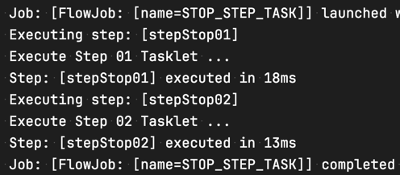

# Spring Batch Study 10

참고: [DEVOCEAN KIDO님 SpringBatch 연재 10](https://devocean.sk.com/blog/techBoardDetail.do?ID=167054)

---

Spring Batch의 Flow Controller 방법에 대해 알아보자.

## 1. Flow Controller

### 개요

- 배치 수행 Flow 컨트롤은 **여러 Step을 정의**하고 조건에 따라 순서대로 실행하거나 **특정 Step을 건너뛸 수 있도록 하는 기능**이다.
- 이는 **FlowBuilder API**를 사용하여 설정된다.

### Flow 컨트롤 방법

- **next** : 현재 Step이 성공적으로 종료되면 다음 Step으로 이동한다.
- **from** : 특정 Step에서 현재 Step으로 이동한다.
- **on** : 특정 ExitStatus에 따라 다음 Step을 결정한다.
- **to** : 특정 Step으로 이동한다.
- **stop** : 현재 Flow를 종료한다.
- **end** : FlowBuilder를 종료한다.

<br>

---

## 2. Flow Controller 구현

**next, on, stop**을 활용하는 Flow Controller를 구현해보자.

### next

**next**는 start 스텝이 수행하고 난 뒤, next 스텝으로 이동하게 된다.

```java

@Slf4j
@Configuration
public class NextStepTaskJobConfiguration {

	public static final String NEXT_STEP_TASK = "NEXT_STEP_TASK";

	@Autowired
	PlatformTransactionManager transactionManager;

	@Bean(name = "step01")
	public Step step01(JobRepository jobRepository, PlatformTransactionManager transactionManager) {
		log.info("------------------ Init myStep -----------------");

		return new StepBuilder("step01", jobRepository)
			.tasklet((contribution, chunkContext) -> {
				log.info("Execute Step 01 Tasklet ...");
				return RepeatStatus.FINISHED;
			}, transactionManager)
			.build();
	}

	@Bean(name = "step02")
	public Step step02(JobRepository jobRepository, PlatformTransactionManager transactionManager) {
		log.info("------------------ Init myStep -----------------");

		return new StepBuilder("step02", jobRepository)
			.tasklet((contribution, chunkContext) -> {
				log.info("Execute Step 02 Tasklet ...");
				return RepeatStatus.FINISHED;
			}, transactionManager)
			.build();
	}

	@Bean
	public Job nextStepJob(Step step01, Step step02, JobRepository jobRepository) {
		log.info("------------------ Init myJob -----------------");
		return new JobBuilder(NEXT_STEP_TASK, jobRepository)
			.incrementer(new RunIdIncrementer())
			.start(step01)
			.next(step02)
			.build();
	}
}
```

- Job의 start 메서드를 통해 첫 step을 지정하고, next 메서드를 통해 다음 step을 지정한다.
- 계속해서 추가 될 수 있으며, start -> next -> next ... 순으로 진행되도록 한다.

### on

**on**은 특정 step의 종료 조건에 따라 어떤 스텝으로 이동할지 결정할 수 있도록 한다.

```java

@Slf4j
@Configuration
public class OnStepTaskJobConfiguration {

	public static final String ON_STEP_TASK = "ON_STEP_TASK";

	@Bean(name = "stepOn01")
	public Step stepOn01(JobRepository jobRepository, PlatformTransactionManager transactionManager) {
		log.info("------------------ Init myStep -----------------");

		return new StepBuilder("stepOn01", jobRepository)
			.tasklet((contribution, chunkContext) -> {
				log.info("Execute Step 01 Tasklet ...");

				Random random = new Random();
				int randomValue = random.nextInt(1000);

				if (randomValue % 2 == 0) {
					return RepeatStatus.FINISHED;
				} else {
					throw new RuntimeException("Error This value is Odd: " + randomValue);
				}
			}, transactionManager)
			.build();
	}

	@Bean(name = "stepOn02")
	public Step stepOn02(JobRepository jobRepository, PlatformTransactionManager transactionManager) {
		log.info("------------------ Init myStep -----------------");

		return new StepBuilder("stepOn02", jobRepository)
			.tasklet((contribution, chunkContext) -> {
				log.info("Execute Step 02 Tasklet ...");
				return RepeatStatus.FINISHED;
			}, transactionManager)
			.build();
	}

	@Bean(name = "stepOn03")
	public Step stepOn03(JobRepository jobRepository, PlatformTransactionManager transactionManager) {
		log.info("------------------ Init myStep -----------------");

		return new StepBuilder("stepOn03", jobRepository)
			.tasklet((contribution, chunkContext) -> {
				log.info("Execute Step 03 Tasklet ...");
				return RepeatStatus.FINISHED;
			}, transactionManager)
			.build();
	}

	@Bean
	public Job onStepJob(Step stepOn01, Step stepOn02, Step stepOn03, JobRepository jobRepository) {
		log.info("------------------ Init myJob -----------------");
		return new JobBuilder(ON_STEP_TASK, jobRepository)
			.incrementer(new RunIdIncrementer())
			.start(stepOn01)
			.on("FAILED").to(stepOn03)
			.from(stepOn01).on("COMPLETED").to(stepOn02)
			.end()
			.build();
	}
}
```

- **stepOn01**을 먼저 수행하고, 결과에 따라서 다음 스텝으로 이동하는 플로우를 보여준다.
- on("FAILED")인 경우 **stepOn03**을 수행하도록 한다.
- from(stepOn01).on("COMPLETED")인 경우 stepOn02 수행하도록 한다.
- on과 from을 통해서 스텝의 종료 조건에 따라 원하는 플로우를 처리할 수 있다.

### stop

**stop**은 특정 step의 작업 결과의 상태를 보고 정지할지 결정한다.

```java

@Slf4j
@Configuration
public class StopStepTaskJobConfiguration {

	public static final String STOP_STEP_TASK = "STOP_STEP_TASK";

	@Bean(name = "stepStop01")
	public Step stepStop01(JobRepository jobRepository, PlatformTransactionManager transactionManager) {
		log.info("------------------ Init myStep -----------------");

		return new StepBuilder("stepStop01", jobRepository)
			.tasklet((contribution, chunkContext) -> {
				log.info("Execute Step 01 Tasklet ...");

				Random random = new Random();
				int randomValue = random.nextInt(1000);

				if (randomValue % 2 == 0) {
					return RepeatStatus.FINISHED;
				} else {
					throw new RuntimeException("Error This value is Odd: " + randomValue);
				}
			}, transactionManager)
			.build();
	}

	@Bean(name = "stepStop02")
	public Step stepStop02(JobRepository jobRepository, PlatformTransactionManager transactionManager) {
		log.info("------------------ Init myStep -----------------");

		return new StepBuilder("stepStop02", jobRepository)
			.tasklet((contribution, chunkContext) -> {
				log.info("Execute Step 02 Tasklet ...");
				return RepeatStatus.FINISHED;
			}, transactionManager)
			.build();
	}

	@Bean
	public Job stopStepJob(Step stepStop01, Step stepStop02, JobRepository jobRepository) {
		log.info("------------------ Init myJob -----------------");
		return new JobBuilder(STOP_STEP_TASK, jobRepository)
			.incrementer(new RunIdIncrementer())
			.start(stepStop01)
			.on("FAILED").stop()
			.from(stepStop01).on("COMPLETED").to(stepStop02)
			.end()
			.build();
	}
}
```

- **stepStop01**의 결과가 실패인경우 stop()을 통해 배치 작업을 정지하고 있다.
- from(stepStop01).on("COMPLETED")인 경우 **stepStop02**를 수행하도록 한다.

### 실행 결과

**nextStepJob 실행 결과**


step01이 수행되고, step02가 수행되는 것을 확인할 수 있다.

**onStepJob 실행 결과**

stepOn01이 수행 중에 아래처럼 Exception이 발생하면 stepOn03이 수행된다.


정상적으로 stepOn01이 완료되면 stepOn02가 수행되는 것을 확인할 수 있다.


**stopStepJob 실행 결과**

stepStop01이 수행 중에 아래처럼 Exception이 발생하면 Job이 종료되는 것을 확인할 수 있다.


정상적으로 stepStop01이 완료되면 stepStop02가 수행되는 것을 확인할 수 있다.


