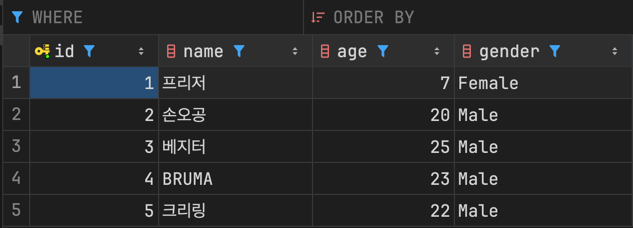
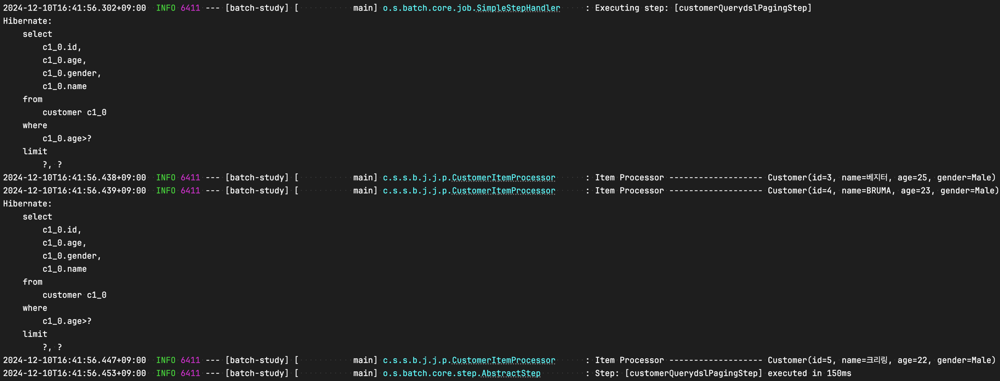
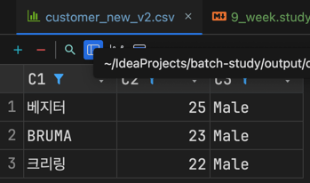

# Spring Batch Study 9

참고: [DEVOCEAN KIDO님 SpringBatch 연재 9](https://devocean.sk.com/blog/techBoardDetail.do?ID=167030)

---

Spring Batch에서 ItemReader/ItemWriter를 입맛에 맞게 커스텀하여 사용하는 방법을 알아보자.

## 1. Querydsl ItemReader

### QuerydslPagingItemReader 개요

- `Querydsl`은 SpringBatch의 공식 ItemReader가 아니다.
- `AbstractPagingItemReader`를 이용하여 `Querydsl` 을 활용할 수 있도록 ItemReader를 만들 것이다.
- **Querydsl 기능 활용**: Querydsl의 강력하고 유연한 쿼리 기능을 사용하여 데이터를 효율적으로 읽을 수 있다.
- **JPA 엔티티 추상화**: JPA 엔티티에 직접 의존하지 않고 추상화된 쿼리를 작성하여 코드 유지 관리성을 높일 수 있다.
- **동적 쿼리 지원**: 런타임 시 조건에 따라 동적으로 쿼리를 생성할 수 있다.

### 주요 구성 요소

- **QuerydslPagingItemReader**: Querydsl을 이용하여 Paging하여 데이터베이스의 값을 읽어 들이는 ItemReader.
- **QuerydslPagingItemReaderBuilder**: QuerydslPagingItemReader를 생성하는 빌더 클래스.

<br>

---

## 2. Querydsl ItemReader 구현

### QuerydslPagingItemReader 구현

우선 `QueryDsl`을 이용하여 Paging하여 데이터베이스의 값을 읽어 들이는 `QuerydslPagingItemReader`를 구현해보자.

```java
...
import org.springframework.batch.item.database.AbstractPagingItemReader;
import org.springframework.util.CollectionUtils;

import com.querydsl.jpa.impl.JPAQuery;
import com.querydsl.jpa.impl.JPAQueryFactory;
...

public class QuerydslPagingItemReader<T> extends AbstractPagingItemReader<T> {

	private EntityManager em;
	private final Function<JPAQueryFactory, JPAQuery<T>> querySupplier;

	private final Boolean alwaysReadFromZero;

	public QuerydslPagingItemReader(String name, EntityManagerFactory entityManagerFactory,
		Function<JPAQueryFactory, JPAQuery<T>> querySupplier, int chunkSize, Boolean alwaysReadFromZero) {
		super.setPageSize(chunkSize);
		setName(name);
		this.querySupplier = querySupplier;
		this.em = entityManagerFactory.createEntityManager();
		this.alwaysReadFromZero = alwaysReadFromZero;

	}

	@Override
	protected void doClose() throws Exception {
		if (em != null)
			em.close();
		super.doClose();
	}

	@Override
	protected void doReadPage() {
		initQueryResult();

		JPAQueryFactory jpaQueryFactory = new JPAQueryFactory(em);
		long offset = 0;
		if (!alwaysReadFromZero) {
			offset = (long)getPage() * getPageSize();
		}

		JPAQuery<T> query = querySupplier.apply(jpaQueryFactory).offset(offset).limit(getPageSize());

		List<T> queryResult = query.fetch();
		for (T entity : queryResult) {
			em.detach(entity);
			results.add(entity);
		}
	}

	private void initQueryResult() {
		if (CollectionUtils.isEmpty(results)) {
			results = new CopyOnWriteArrayList<>();
		} else {
			results.clear();
		}
	}
}
```

- `AbstractPagingItemReader` 를 상속받아서 **doReadPage**만 구현하면 된다.
- 생성자
    - **name** : ItemReader를 구분하기 위한 이름이다.
    - **entityManagerFactory** : JPA를 이용하기 위해서 entityManagerFactory를 전달한다.
    - **Function<JPAQueryFactory, JPAQuery>** : 이는 JPAQuery를 생성하기 위한 Functional Interface이다.
        - 입력 파라미터로 JPAQueryFactory 를 입력으로 전달 받는다.
        - 반환값은 JPAQuery 형태의 queryDSL 쿼리가 된다.
    - **chunkSize** : 한 번에 읽어올 데이터의 크기이다.
    - **alwaysReadFromZero** : 항상 0부터 페이지를 읽어올 것인지 여부를 결정한다.
- **doClose()**
    - EntityManager 자원을 해제하기 위해서 em.close() 를 수행한다.
    - 부모 클래스의 doClose()를 호출한다.
- **doReadPage()**
    - 실제로 구현해야할 추상 메소드이다.
    - querySupplier.apply : querySupplier에 JPAQueryFactory를 적용하여 JPAQuery를 생성한다.
    - query.fetch() : 생성된 query를 실행하여 패치된 내역을 result에 담는다.
- **initQueryResult()**
    - 매 페이징 결과를 반환할때 페이징 결과만 반환하기 위해서 초기화한다.
    - 만약 결과객체가 초기화 되어 있지 않다면 CopyOnWriteArrayList 객체를 신규로 생성한다.

### QuerydslPagingItemReaderBuilder 구현

`QuerydslPagingItemReader` 클래스의 생성자는 조금 복잡했다. 이를 편하게 작성하기 위해서 빌더를 생성해보자.

```java
public class QuerydslPagingItemReaderBuilder<T> {

	private EntityManagerFactory entityManagerFactory;
	private Function<JPAQueryFactory, JPAQuery<T>> querySupplier;

	private int chunkSize = 10;

	private String name;

	private Boolean alwaysReadFromZero;

	public QuerydslPagingItemReaderBuilder<T> entityManagerFactory(EntityManagerFactory entityManagerFactory) {
		this.entityManagerFactory = entityManagerFactory;
		return this;
	}

	public QuerydslPagingItemReaderBuilder<T> querySupplier(Function<JPAQueryFactory, JPAQuery<T>> querySupplier) {
		this.querySupplier = querySupplier;
		return this;
	}

	public QuerydslPagingItemReaderBuilder<T> chunkSize(int chunkSize) {
		this.chunkSize = chunkSize;
		return this;
	}

	public QuerydslPagingItemReaderBuilder<T> name(String name) {
		this.name = name;
		return this;
	}

	public QuerydslPagingItemReaderBuilder<T> alwaysReadFromZero(Boolean alwaysReadFromZero) {
		this.alwaysReadFromZero = alwaysReadFromZero;
		return this;
	}

	public QuerydslPagingItemReader<T> build() {
		if (name == null) {
			this.name = ClassUtils.getShortName(QuerydslPagingItemReader.class);
		}
		if (this.entityManagerFactory == null) {
			throw new IllegalArgumentException("EntityManagerFactory can not be null.!");
		}
		if (this.querySupplier == null) {
			throw new IllegalArgumentException("Function<JPAQueryFactory, JPAQuery<T>> can not be null.!");
		}
		if (this.alwaysReadFromZero == null) {
			alwaysReadFromZero = false;
		}
		return new QuerydslPagingItemReader<>(this.name, entityManagerFactory, querySupplier, chunkSize,
			alwaysReadFromZero);
	}
}
```

- Builder 패턴을 이용하여 단순히 `QuerydslPgingItemReader` 객체를 생성하는 코드일 뿐이다.

### QueryDSLPagingReaderJobConfig 구현

이제 `QuerydslPagingItemReader`를 사용하여 Job을 구성해보자.

```java

@Slf4j
@Configuration
public class QueryDSLPagingReaderJobConfig {

	/**
	 * CHUNK 크기를 지정한다.
	 */
	public static final int CHUNK_SIZE = 2;
	public static final String ENCODING = "UTF-8";
	public static final String QUERYDSL_PAGING_CHUNK_JOB = "QUERYDSL_PAGING_CHUNK_JOB";

	@Autowired
	EntityManagerFactory entityManagerFactory;

	@Bean
	public QuerydslPagingItemReader<Customer> customerQuerydslPagingItemReader() {
		return new QuerydslPagingItemReaderBuilder<Customer>()
			.name("customerQuerydslPagingItemReader")
			.entityManagerFactory(entityManagerFactory)
			.chunkSize(2)
			.querySupplier(jpaQueryFactory ->
				jpaQueryFactory.select(QCustomer.customer)
							   .from(QCustomer.customer)
							   .where(QCustomer.customer.age.gt(20)))
			.build();
	}

	@Bean
	public FlatFileItemWriter<Customer> customerQuerydslFlatFileItemWriter() {

		return new FlatFileItemWriterBuilder<Customer>()
			.name("customerQuerydslFlatFileItemWriter")
			.resource(new FileSystemResource("./output/customer_new_v2.csv"))
			.encoding(ENCODING)
			.delimited().delimiter("\t")
			.names("Name", "Age", "Gender")
			.build();
	}

	@Bean
	public Step customerQuerydslPagingStep(JobRepository jobRepository,
		PlatformTransactionManager transactionManager) throws Exception {
		log.info("------------------ Init customerQuerydslPagingStep -----------------");

		return new StepBuilder("customerJpaPagingStep", jobRepository)
			.<Customer, Customer>chunk(CHUNK_SIZE, transactionManager)
			.reader(customerQuerydslPagingItemReader())
			.processor(new CustomerItemProcessor())
			.writer(customerQuerydslFlatFileItemWriter())
			.build();
	}

	@Bean
	public Job customerQuerydslPagingJob(Step customerQuerydslPagingStep, JobRepository jobRepository) {
		log.info("------------------ Init customerJpaPagingJob -----------------");
		return new JobBuilder(QUERYDSL_PAGING_CHUNK_JOB, jobRepository)
			.incrementer(new RunIdIncrementer())
			.start(customerQuerydslPagingStep)
			.build();
	}
}
```

- Querydsl은 공식 Spring Batch ItemReader가 아니므로 `AbastractPagingItemReader`를 상속받아 구현했다.
- `QuerydslPagingItemReader` 빈을 생성하고 **entityManagerFactory**, **querySupplier**를 설정해준다.
    - Customer 테이블에서 나이가 20보다 큰 데이터를 2개씩 조회하는 jpaQueryFactory를 등록한다.
- `FlatFileItemWriter` 빈을 등록하여 **output** 디렉토리에 **customer_new_v2.csv** 파일을 생성한다.
- `Job`, `Step` 빈을 생성하고 **chunk**, **reader**, **writer**를 설정한다.

### 실행 결과

먼저 customer 테이블에 저장된 데이터를 확인해보자.



스프링배치를 실행하여 `customerQuerydslPagingStep`을 실행시켜보자.  
chunkSize가 2이므로 2개씩 데이터를 읽어올 것이다.



로그를 확인해보니 2번의 select 쿼리가 발생했다. customer 테이블에 나이가 20보다 큰 데이터가 3개이기 때문에 2번의 쿼리가 발생한 것이다.  
customer_new_v2.csv 파일도 생성되어 데이터가 잘 저장된 것을 확인할 수 있다.


